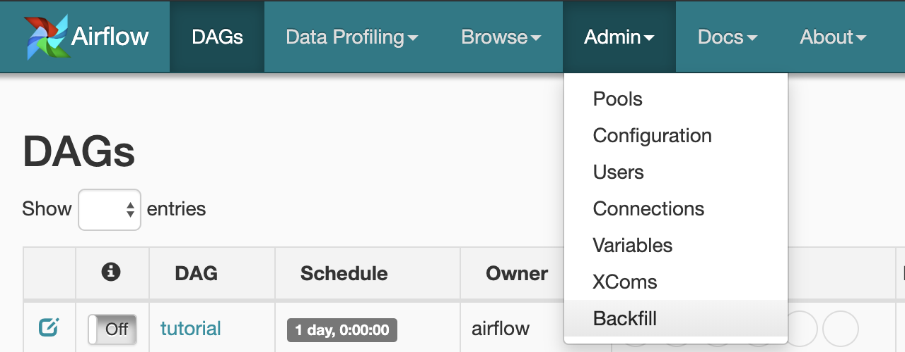
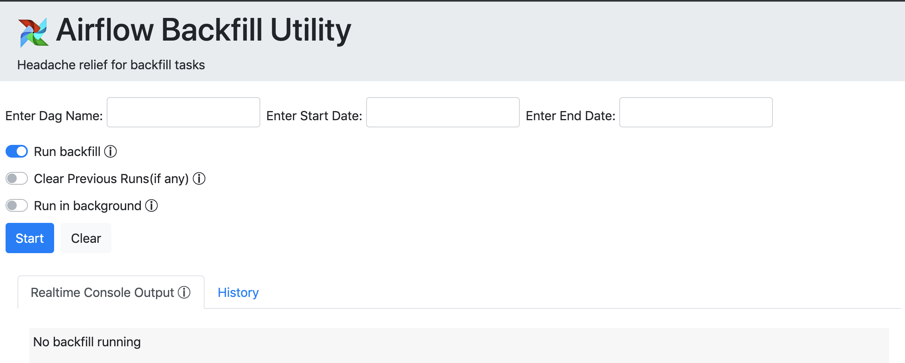
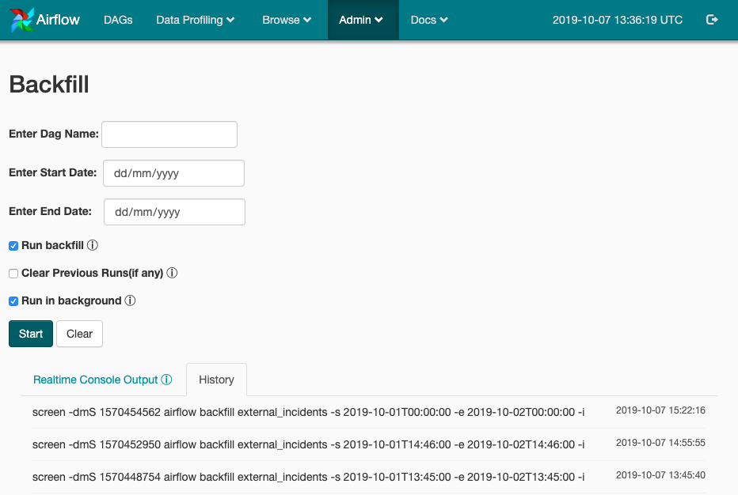

# Airflow Backfill Plugin
Backfilling made easy. With UI built with Bootstrap 4, backfilling is just a piece of cake. No need to login in your Airflow Environment VM/Setup everytime to run command line for backfill and clearing DAG runs. This plugin easily integrates with Airflow Webserver and makes your tasks easier by giving you the same control as command line does. 

## How to Use 
- Plugin is easily navigable from "Admin" menu link

- Enter your DAG name, start date, end date. Select whether you want to run backfill OR clear. You can also select "Run in Background", in case you want to just submit the job and close the backfill window. If "Run in background" is unchecked then you would be able to see realtime logs of the job you've submitted.

- History tab shows you jobs so far along with their last runtime 

## Plugin Directory Structure
```
├── __init__.py
├── backfill
│   ├── __init__.py
│   ├── main.py
│   └── requirements.txt
└── templates
    └── backfill_page.html
```
- `backfill` folder contains `main.py` file. This contains the backend logic for backfill. For eg. executing airflow CLI commands on user request
- `template` folder contains webpage from which user runs/request backfill OR clear commands
- `__init__.py` file contains backfill plugin instantiation logic with Airflow Webserver 
- 

## Setup
1. Clone the repository in your system
2. Plugin configuration
    - If its a fresh Airflow Environment, simple put the `plugin` folder inside your codebase and modify  `plugin_folder=<plugin_path>` option in your `airflow.cfg` file. 
    - if its an existing Airflow Environment. Navigate to existing `plugins` folder in your code base. Extend your existing `__init__.py`  file by `__init__.py` of this plugin.
3. There is one dependency for this plugin. Just run `pip install shelljob` in your Airflow Environment.
4. All done ! Just restart your `webserver` and you are good to go.

Feels Awesome ! Start contributing.

Author - ankur.choryawal@news.co.uk